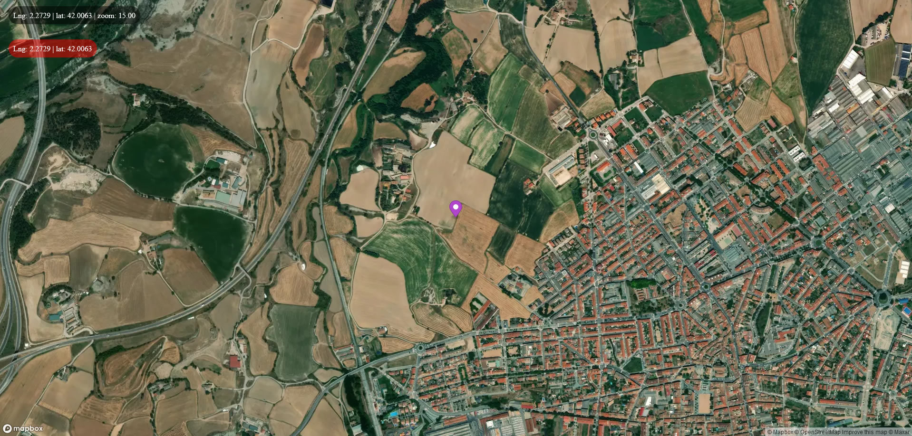

# Live Map Sockets

**mapas-app:** npm i && npm start

**mapas-server:** npm i && npm run dev

-   This project allows us to share our location on a map with other people, thanks to React.js and socket.io
-   Demo: <https://react-map-live.herokuapp.com>

